

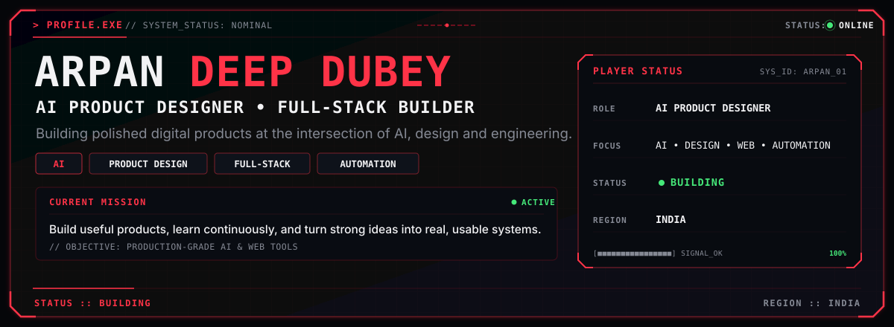

  

&nbsp;

&nbsp;

&nbsp;

  

---

## 🧭 PLAYER PROFILE

<table>
<tr>
<td width="38%" align="center" valign="middle">

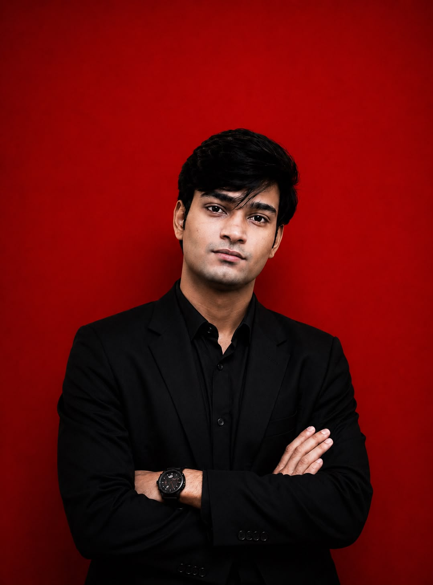

</td>

<td width="62%" valign="top">

### ARPAN DEEP DUBEY

**AI Product Designer & Full-Stack Builder**

I build polished digital products where **AI, product thinking, design and engineering** meet.

<table>
<tr><td><b>Class</b></td><td>AI Product Designer</td></tr>
<tr><td><b>Subclass</b></td><td>Full-Stack Builder</td></tr>
<tr><td><b>Region</b></td><td>India</td></tr>
<tr><td><b>Focus</b></td><td>AI • Design • Web • Automation</td></tr>
<tr><td><b>Playstyle</b></td><td>Design → Build → Ship</td></tr>
</table>

 

**Current mission**

Build useful products, learn continuously, and turn strong ideas into things people can actually use.

 

**Contact**

`arpandubey21@gmail.com`

</td>
</tr>
</table>

---

## 🎯 QUEST BOARD

`CURRENT MISSIONS`

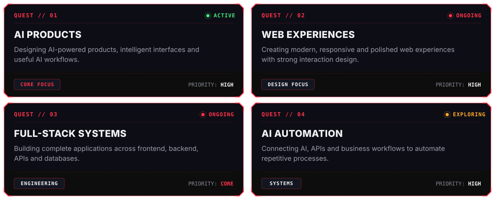

---

## ⚔️ TECH ARSENAL

  

---

## 🧩 BUILDING FOCUS

`CURRENT AREAS OF WORK`

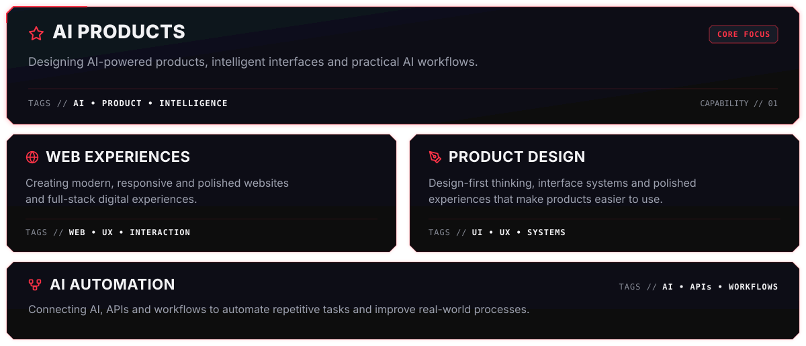

---

## 📊 CONTRIBUTION ACTIVITY

  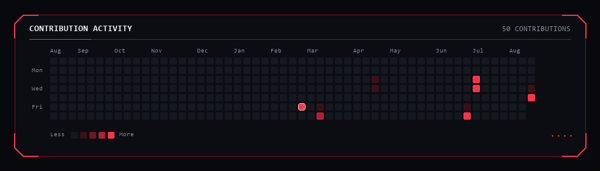

---

## 🏆 ACHIEVEMENTS

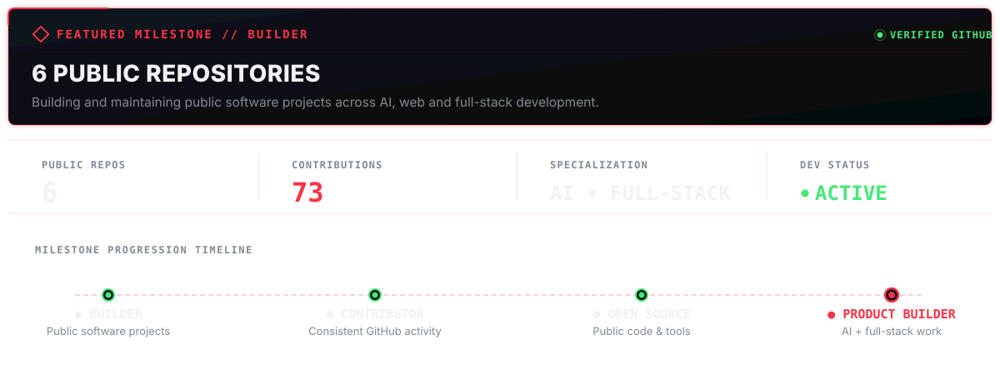

---

## 🧠 BUILD PHILOSOPHY

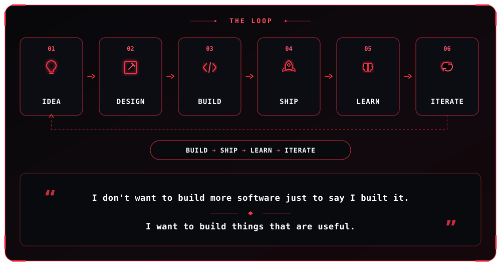

---

## 📡 CONTACT

<code>SELECT CONNECTION</code>

<table width="100%">
<tr>
  <td width="50%"><a href="https://arpanstudio.dev/">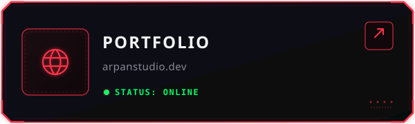</a></td>
  <td width="50%"><a href="mailto:arpandubey21@gmail.com">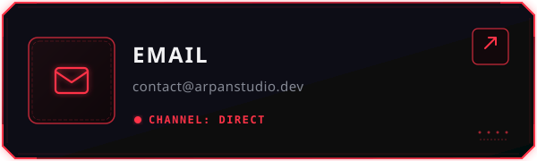</a></td>
</tr>
<tr>
  <td width="50%"><a href="https://www.linkedin.com/in/arpan-deep-dubey/">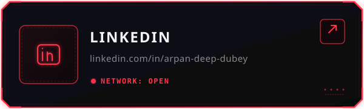</a></td>
  <td width="50%"><a href="https://github.com/adix-design">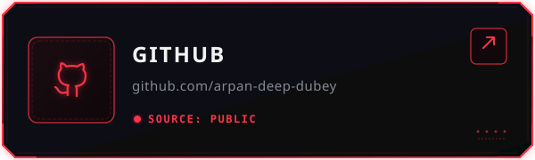</a></td>
</tr>
</table>
