<!-- ╔══════════════════════════════════════════════════════════════════════════╗ -->
<!-- ║                                                                          ║ -->
<!-- ║   ██████╗ ██████╗ ██████╗  █████╗ ███╗   ██╗    ██╗  ██╗██╗   ██╗██████╗ ║ -->
<!-- ║  ██╔══██╗██╔══██╗██╔══██╗██╔══██╗████╗  ██║    ██║  ██║██║   ██║██╔══██╗ ║ -->
<!-- ║  ███████║██████╔╝██████╔╝███████║██╔██╗ ██║    ███████║██║   ██║██║  ██║ ║ -->
<!-- ║  ██╔══██║██╔══██╗██╔═══╝ ██╔══██║██║╚██╗██║    ██╔══██║██║   ██║██║  ██║ ║ -->
<!-- ║  ██║  ██║██║  ██║██║     ██║  ██║██║ ╚████║    ██║  ██║╚██████╔╝██████╔╝ ║ -->
<!-- ║  ╚═╝  ╚═╝╚═╝  ╚═╝╚═╝     ╚═╝  ╚═╝╚═╝  ╚═══╝    ╚═╝  ╚═╝ ╚═════╝ ╚═════╝ ║ -->
<!-- ║                                                                          ║ -->
<!-- ║           GAMEIFIED RPG DEVELOPER PROFILE • CYBERPUNK EDITION            ║ -->
<!-- ╚══════════════════════════════════════════════════════════════════════════╝ -->

<div align="center">

<!-- ═══════════════════════════════════════════════════════════════════════ -->
<!-- ░░░░░░░░░░░░░░░░░░░░░  SECTION 01 : PLAYER / HERO  ░░░░░░░░░░░░░░░░░ -->
<!-- ═══════════════════════════════════════════════════════════════════════ -->

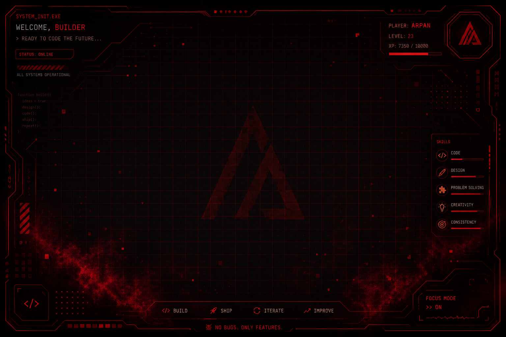

<br/>


<br/><br/>


<br/><br/>

<!-- QUICK ACCESS NAV -->

<a href="https://arpanstudio.dev">

</a>
&nbsp;
<a href="https://www.linkedin.com/in/arpan-deep-dubey/">

</a>
&nbsp;
<a href="mailto:contact@arpanstudio.dev">

</a>
&nbsp;
<a href="https://github.com/adix-design">

</a>

<br/><br/>


</div>

<br/>

<!-- ═══════════════════════════════════════════════════════════════════════ -->
<!-- ░░░░░░░░░░░░░░░░░░  SECTION 02 : PLAYER PROFILE  ░░░░░░░░░░░░░░░░░░ -->
<!-- ═══════════════════════════════════════════════════════════════════════ -->

<div align="center">


</div>

<br/>

<table>
<tr>

<td width="30%" align="center" valign="top">

<br/>


<br/><br/>

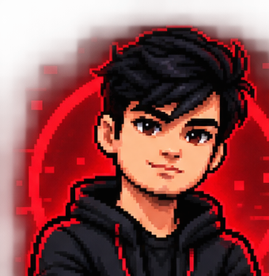

<br/>

</td>

<td width="70%" valign="top">

```
╔══════════════════════════════════════════════════════════════╗
║                    ◆ PLAYER DATA FILE ◆                     ║
╠══════════════════════════════════════════════════════════════╣
║                                                              ║
║  CODENAME    :: ARPAN DEEP DUBEY                            ║
║  CLASS       :: AI PRODUCT DESIGNER                         ║
║  SUBCLASS    :: FULL-STACK BUILDER                          ║
║  REGION      :: INDIA                                       ║
║  FACTION     :: ARPAN STUDIO                                ║
║  STATUS      :: ◉ ONLINE                                    ║
║                                                              ║
╠══════════════════════════════════════════════════════════════╣
║                                                              ║
║  ❤️ HP   ██████████████████████████████████████████░░  95%   ║
║  ⚡ XP   █████████████████████████████████████░░░░░░  73%   ║
║  🔥 STR  ████████████████████████████████░░░░░░░░░░  65%   ║
║  🧠 INT  ██████████████████████████████████████████  100%   ║
║  🎯 DEX  █████████████████████████████████████░░░░░  80%   ║
║  🛡️ DEF  ██████████████████████████████████░░░░░░░░  70%   ║
║                                                              ║
╠══════════════════════════════════════════════════════════════╣
║                                                              ║
║  SPECIALIZATION :: AI × PRODUCT DESIGN × ENGINEERING        ║
║  PLAYSTYLE      :: Design-first. Build fast. Ship real.     ║
║  MISSION        :: Turn ideas into real, useful products.   ║
║                                                              ║
║  TRAITS                                                      ║
║    ◈ Design-first approach                                  ║
║    ◈ AI-assisted product development                        ║
║    ◈ Full-stack web development                             ║
║    ◈ Automation & intelligent workflows                     ║
║    ◈ Relentless iteration                                   ║
║                                                              ║
╚══════════════════════════════════════════════════════════════╝
```

</td>

</tr>
</table>

<br/>

<!-- ═══════════════════════════════════════════════════════════════════════ -->
<!-- ░░░░░░░░░░░░░░░░░░░  SECTION 03 : QUEST BOARD  ░░░░░░░░░░░░░░░░░░░░ -->
<!-- ═══════════════════════════════════════════════════════════════════════ -->

<div align="center">


<br/><br/>


</div>

<br/>

<table>
<tr>

<td width="25%" valign="top" align="center">

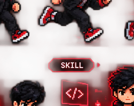

**`⚔️ QUEST 01`**

**AI PRODUCTS**

```
RANK    : ★★★★☆
REWARD  : +500 XP
STATUS  : IN PROGRESS
```

*Building AI-powered applications, intelligent interfaces & useful workflows.*

```
▓▓▓▓▓▓▓▓░░  80%
```

</td>

<td width="25%" valign="top" align="center">

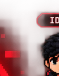

**`🌐 QUEST 02`**

**WEB EXPERIENCES**

```
RANK    : ★★★☆☆
REWARD  : +350 XP
STATUS  : IN PROGRESS
```

*Modern, responsive & animated digital experiences that captivate.*

```
▓▓▓▓▓▓▓░░░  70%
```

</td>

<td width="25%" valign="top" align="center">

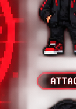

**`💻 QUEST 03`**

**FULL-STACK APPS**

```
RANK    : ★★★★☆
REWARD  : +450 XP
STATUS  : IN PROGRESS
```

*End-to-end applications with polished frontend & backend systems.*

```
▓▓▓▓▓▓▓░░░  75%
```

</td>

<td width="25%" valign="top" align="center">

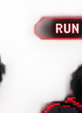

**`⚙️ QUEST 04`**

**AUTOMATION**

```
RANK    : ★★★☆☆
REWARD  : +400 XP
STATUS  : IN PROGRESS
```

*AI, APIs & workflows that eliminate repetitive work.*

```
▓▓▓▓▓▓░░░░  65%
```

</td>

</tr>
</table>

<br/>

<!-- ═══════════════════════════════════════════════════════════════════════ -->
<!-- ░░░░░░░░░░░░░░░░░░░  SECTION 04 : TECH ARSENAL  ░░░░░░░░░░░░░░░░░░░ -->
<!-- ═══════════════════════════════════════════════════════════════════════ -->

<div align="center">


<br/><br/>

```
                    ┌─────────────────────────────────────────────┐
                    │         ⚔️  EQUIPPED LOADOUT  ⚔️            │
                    │    >> OPTIMIZED FOR MAXIMUM OUTPUT <<       │
                    └─────────────────────────────────────────────┘
```

<br/>

**`▸ FRONTEND WEAPONS`**


<br/><br/>

**`▸ BACKEND ARSENAL`**


<br/><br/>

**`▸ TOOLS & UTILITIES`**


<br/><br/>

**`▸ AI AUGMENTS`**


<br/><br/>

**`▸ DESIGN TOOLKIT`**


<br/>

```
┌──────────────────────────────────────────────────────────────────┐
│  LOADOUT STATUS : ◉ ALL SYSTEMS ARMED                           │
│  COMBAT READY  : TRUE                                           │
│  LAST UPGRADE  : AI AUGMENTATION MODULE v3.0                    │
└──────────────────────────────────────────────────────────────────┘
```

</div>

<br/>

<!-- ═══════════════════════════════════════════════════════════════════════ -->
<!-- ░░░░░░░░░░░░░░░░░  SECTION 05 : GITHUB DASHBOARD  ░░░░░░░░░░░░░░░░░ -->
<!-- ═══════════════════════════════════════════════════════════════════════ -->

<div align="center">


<br/><br/>


<br/><br/>

<!-- STATS ROW -->

&nbsp;


<br/><br/>

<!-- LANGUAGES -->


<br/><br/>

<!-- ACTIVITY GRAPH -->


</div>

<br/>

<!-- ═══════════════════════════════════════════════════════════════════════ -->
<!-- ░░░░░░░░░░░░░░░░░  SECTION 06 : CONTRIBUTION SNAKE  ░░░░░░░░░░░░░░░ -->
<!-- ═══════════════════════════════════════════════════════════════════════ -->

<div align="center">


<br/><br/>

<picture>
  <source media="(prefers-color-scheme: dark)" srcset="https://raw.githubusercontent.com/adix-design/adix-design/output/github-contribution-grid-snake-dark.svg">
  <source media="(prefers-color-scheme: light)" srcset="https://raw.githubusercontent.com/adix-design/adix-design/output/github-contribution-grid-snake.svg">
  
</picture>

<br/><br/>


</div>

<br/>

<!-- ═══════════════════════════════════════════════════════════════════════ -->
<!-- ░░░░░░░░░░░░░░░░░░░░  SECTION 07 : ACHIEVEMENTS  ░░░░░░░░░░░░░░░░░░ -->
<!-- ═══════════════════════════════════════════════════════════════════════ -->

<div align="center">


<br/><br/>


<br/><br/>

<table>
<tr>

<td align="center" width="16%">
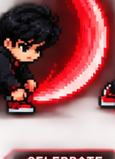
<br/>
<sub><b>🏆 BUILDER</b></sub>
<br/>
<sub>Ship Real Products</sub>
</td>

<td align="center" width="16%">
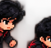
<br/>
<sub><b>🔥 ON FIRE</b></sub>
<br/>
<sub>Streak Warrior</sub>
</td>

<td align="center" width="16%">
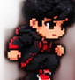
<br/>
<sub><b>😎 SMOOTH</b></sub>
<br/>
<sub>Clean Code</sub>
</td>

<td align="center" width="16%">
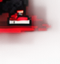
<br/>
<sub><b>⚛️ REACT PRO</b></sub>
<br/>
<sub>Frontend Master</sub>
</td>

<td align="center" width="16%">
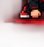
<br/>
<sub><b>🐙 OPEN SRC</b></sub>
<br/>
<sub>GitHub Native</sub>
</td>

<td align="center" width="16%">
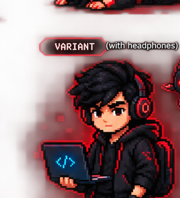
<br/>
<sub><b>🎧 FOCUSED</b></sub>
<br/>
<sub>Deep Work Mode</sub>
</td>

</tr>
</table>

</div>

<br/>

<!-- ═══════════════════════════════════════════════════════════════════════ -->
<!-- ░░░░░░░░░░░░░░░░░  SECTION 08 : PLAYER PROGRESSION  ░░░░░░░░░░░░░░░ -->
<!-- ═══════════════════════════════════════════════════════════════════════ -->

<div align="center">


</div>

<br/>

<table>
<tr>

<td width="50%" valign="top">

<div align="center">

**`🔥 STREAK MODE`**


</div>

</td>

<td width="50%" valign="top">

<div align="center">

**`🧩 LANGUAGE MASTERY`**


</div>

</td>

</tr>
</table>

<br/>

<div align="center">

```
╔══════════════════════════════════════════════════════════════════╗
║                                                                  ║
║                   🎖️  CURRENT RANK : BUILDER ELITE              ║
║                                                                  ║
║   ┌──────────────────────────────────────────────────────────┐  ║
║   │                                                          │  ║
║   │   🎨 DESIGN      ██████████████████████████████░░  90%  │  ║
║   │   💻 BUILD       █████████████████████████░░░░░░░  82%  │  ║
║   │   🚀 SHIP        ████████████████████████░░░░░░░░  74%  │  ║
║   │   🧠 LEARN       ██████████████████████████████████ 100% │  ║
║   │   🤖 AI          █████████████████████████████░░░  88%  │  ║
║   │   ⚡ SPEED       ██████████████████████████░░░░░░  78%  │  ║
║   │                                                          │  ║
║   └──────────────────────────────────────────────────────────┘  ║
║                                                                  ║
║              ◈ NEXT RANK : LEGENDARY ARCHITECT ◈                ║
║              ◈ REQUIREMENT : KEEP SHIPPING.    ◈                ║
║                                                                  ║
╚══════════════════════════════════════════════════════════════════╝
```

<br/>

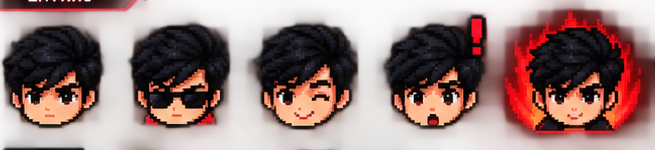

</div>

<br/>

<!-- ═══════════════════════════════════════════════════════════════════════ -->
<!-- ░░░░░░░░░░░░░░░░░  SECTION 09 : CONTACT TERMINAL  ░░░░░░░░░░░░░░░░░ -->
<!-- ═══════════════════════════════════════════════════════════════════════ -->

<div align="center">


<br/><br/>


<br/><br/>

```
╔══════════════════════════════════════════════════════════════╗
║                                                              ║
║  > ssh arpan@cyberspace --connect                           ║
║                                                              ║
║  ┌──────────────────────────────────────────────────────┐   ║
║  │  CONNECTION ESTABLISHED                               │   ║
║  │                                                       │   ║
║  │  PORTFOLIO  ─── https://arpanstudio.dev              │   ║
║  │  EMAIL      ─── contact@arpanstudio.dev              │   ║
║  │  LINKEDIN   ─── linkedin.com/in/arpan-deep-dubey     │   ║
║  │  GITHUB     ─── github.com/adix-design               │   ║
║  │                                                       │   ║
║  │  STATUS     ─── ◉ AVAILABLE FOR INTERESTING BUILDS   │   ║
║  │  RESPONSE   ─── < 24 HOURS                           │   ║
║  └──────────────────────────────────────────────────────┘   ║
║                                                              ║
║  > AWAITING TRANSMISSION... █                               ║
║                                                              ║
╚══════════════════════════════════════════════════════════════╝
```

<br/>

<a href="mailto:contact@arpanstudio.dev">

</a>
&nbsp;&nbsp;
<a href="https://arpanstudio.dev">

</a>
&nbsp;&nbsp;
<a href="https://www.linkedin.com/in/arpan-deep-dubey/">

</a>

<br/><br/>

<!-- MISSION STATEMENT -->


<br/><br/>

<!-- PIXEL ART FULL SPRITE SHEET -->

<details>
<summary><b>🎮 VIEW FULL PIXEL SPRITE SHEET</b></summary>
<br/>
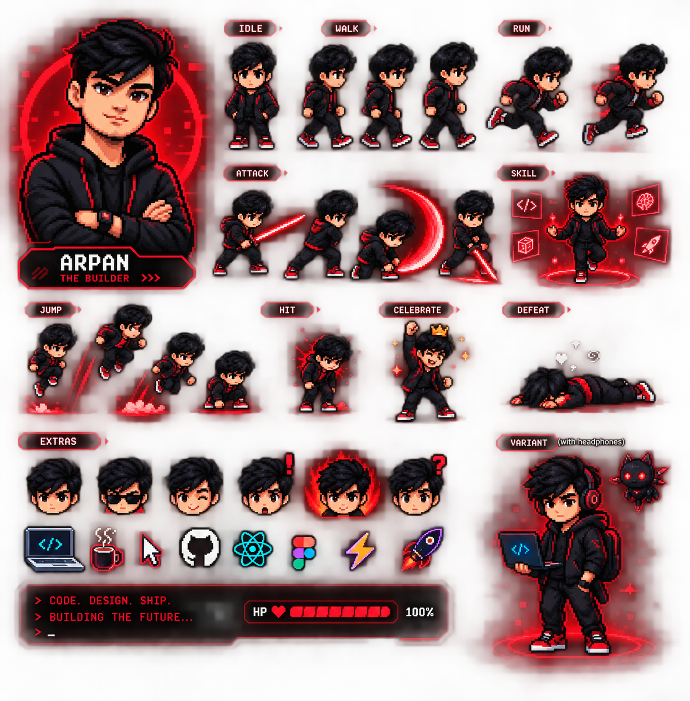
</details>

<br/><br/>

<!-- FOOTER -->

```
┌──────────────────────────────────────────────────────────────────────┐
│                                                                      │
│   > THANK YOU FOR VISITING, TRAVELER.                               │
│   > MAY YOUR CODE COMPILE AND YOUR DEPLOYS SUCCEED.                 │
│   > UNTIL NEXT TIME... ◉                                            │
│                                                                      │
│                      ◆ ARPAN DEEP DUBEY ◆                           │
│                 AI PRODUCT DESIGNER × FULL-STACK BUILDER            │
│                                                                      │
│   ╔═══╗  ╔═══╗  ╔═══╗  ╔═══╗  ╔═══╗  ╔═══╗                       │
│   ║ D ║  ║ E ║  ║ S ║  ║ I ║  ║ G ║  ║ N ║                       │
│   ╚═══╝  ╚═══╝  ╚═══╝  ╚═══╝  ╚═══╝  ╚═══╝                       │
│                                                                      │
│   ╔═══╗  ╔═══╗  ╔═══╗  ╔═══╗  ╔═══╗                               │
│   ║ B ║  ║ U ║  ║ I ║  ║ L ║  ║ D ║                               │
│   ╚═══╝  ╚═══╝  ╚═══╝  ╚═══╝  ╚═══╝                               │
│                                                                      │
│   ╔═══╗  ╔═══╗  ╔═══╗  ╔═══╗                                       │
│   ║ S ║  ║ H ║  ║ I ║  ║ P ║                                       │
│   ╚═══╝  ╚═══╝  ╚═══╝  ╚═══╝                                       │
│                                                                      │
└──────────────────────────────────────────────────────────────────────┘
```

<br/>


</div>
